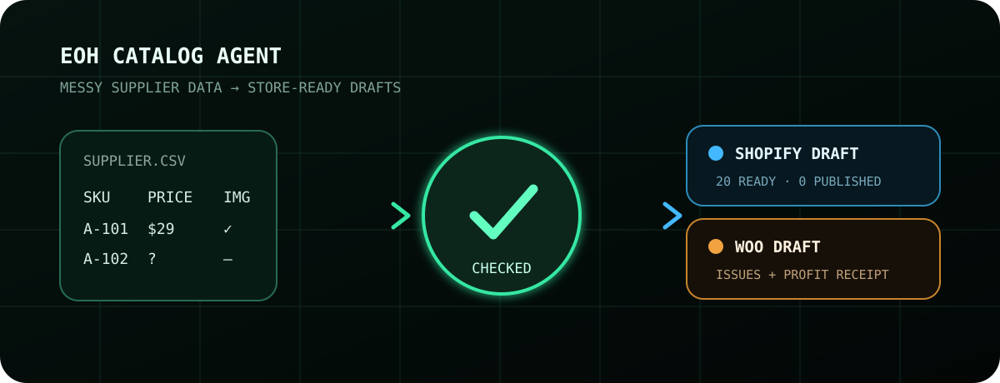

# EOH Catalog Agent



> Turn a messy supplier spreadsheet into a checked Shopify or WooCommerce catalog — without publishing a broken product.

Give the agent a CSV/XLSX. It normalizes product data, quarantines duplicates and broken rows, and produces store-ready draft imports plus an auditable job receipt.

- Shopify and WooCommerce outputs from one source catalog
- automatic aliases for common supplier column names
- duplicate SKU, missing field, price, and stock checks
- non-zero exit for incomplete batches
- revenue, execution cost, and net-profit receipt

```text
supplier.csv  ->  checked catalog  ->  Shopify / WooCommerce drafts
                         |
                         +---------> issues.csv + receipt.json
```

## Install

```bash
pipx install git+https://github.com/meanwebuser/eoh-catalog-agent.git
```

## Process a paid test batch

```bash
eoh-catalog-agent prepare supplier.csv \
  --out run/client-test \
  --store both \
  --limit 20 \
  --job-id marketplace-job-123 \
  --revenue-usd 20 \
  --expense-usd 0.05
```

Outputs:

- `products.normalized.csv` — clean canonical catalog;
- `shopify_import.csv` — Shopify draft import;
- `woocommerce_import.csv` — WooCommerce unpublished import;
- `issues.csv` — rows that require correction;
- `receipt.json` — batch counts, input hash, targets, and artifact paths.

When revenue and execution expense are supplied, the receipt also records the job's net profit. A batch containing quarantined rows exits non-zero so an automated runner cannot report incomplete work as finished.

Required input columns are `name`, `sku`, and `price`; common supplier aliases such as `Product Name`, `Variant SKU`, `Regular Price`, `Image URL`, and `Vendor` are recognized automatically.

The agent does not publish products or send marketplace proposals. A human reviews the import and explicitly launches publishing.

## Verify from source

```bash
python3 -m venv .venv
.venv/bin/pip install -e '.[test]'
.venv/bin/pytest -q
```
